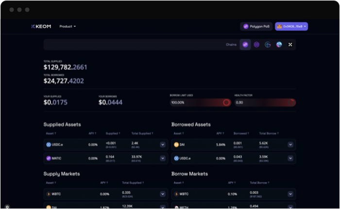
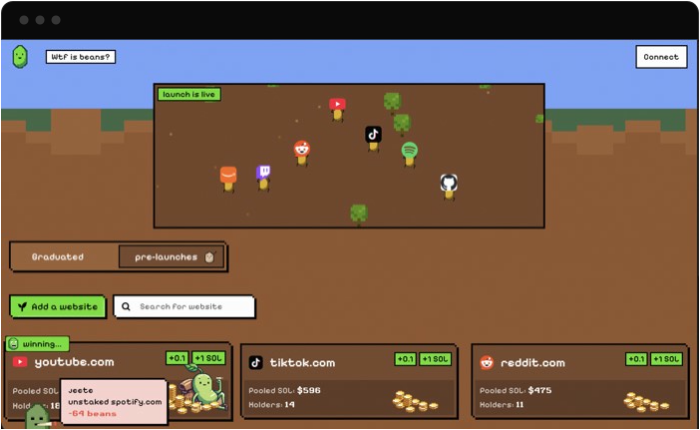

  Co-founded <b>Vanta</b>, a Health OS. Built <b>Mudrex</b>'s app, now past <b>10M+ downloads</b>. 
  Most of it lives in private repos.

  
  &nbsp;&nbsp;&nbsp;
  

  Vanta Health OS · App Store&nbsp;&nbsp;&nbsp;&nbsp;&nbsp;&nbsp;&nbsp;&nbsp;Mudrex · 10M+ downloads

  
  &nbsp;&nbsp;
  

  Keom · $10M TVL&nbsp;&nbsp;&nbsp;&nbsp;&nbsp;&nbsp;&nbsp;&nbsp;&nbsp;&nbsp;&nbsp;&nbsp;&nbsp;&nbsp;Beans

  

  

  

